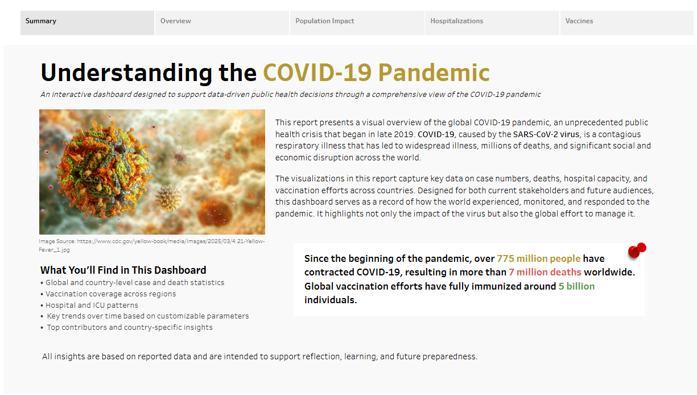

# COVID-19 Pandemic Dashboard

**Developed by:**
1. Pam Cassedy Dumangeng
2. Kim Carly Esperanza
3. Louella Josephine Ng
4. Gio Miguel Bihasa
   
An interactive Tableau dashboard that explores the global COVID-19 pandemic across four views: cases and deaths, population impact, vaccinations, and hospitalizations.

**Live dashboard:** [View on Tableau Public](https://public.tableau.com/app/profile/pam.cassedy/viz/FinalProjectDataViz_17763998736500/Story1)



## What the dashboard covers

| Dashboard             | What it shows                                                                                                                                                        |
| --------------------- | -------------------------------------------------------------------------------------------------------------------------------------------------------------------- |
| **Overview**          | Global map, cases and deaths over time, headline totals, and the top five contributing countries.                                                                    |
| **Population impact** | A custom impact score by country, the countries with the most deaths, and how age structure and comorbidities (cardiovascular disease, diabetes) relate to outcomes. |
| **Vaccines**          | Vaccination coverage on a map, with fully vaccinated, partially vaccinated, and not vaccinated populations compared by country.                                      |
| **Hospitalizations**  | Hospital and ICU patients over time, compared with hospital bed capacity, plus peak ICU load.                                                                        |

## Interactive controls

Viewers can change what the dashboards display:

* **Metric focus:** total or new cases and deaths
* **Interval:** switch the time view for cases or deaths
* **Vaccination metric:** fully or partially vaccinated
* **Continent:** filter to one region or view the whole world
* **Comorbidity and age group:** choose which factor ranks the countries

Titles, labels, and KPI cards update automatically to match the selection.

## Dashboard Development

* 4 dashboards built from 27 worksheets
* About 50 calculated fields, including fixed level-of-detail (LOD) expressions that pull each country's latest value
* 6 parameters that drive the dynamic titles, filters, and metric switching
* A composite **impact score** that combines new cases and new deaths per million people, with deaths weighted 10 times as heavily as cases
* A rank-based top-N view that updates with the selected comorbidity or age metric

## Data

* **Source:** [Our World in Data COVID-19 dataset](https://github.com/owid/covid-19-data/tree/master/public/data), which compiles case, death, testing, vaccination, and hospitalization data from national sources.
* **Size:** 429,435 rows and 67 columns, with one row per location per day.
* **Period:** January 1, 2020 to August 14, 2024.
* **Coverage:** 255 locations, including countries and aggregates such as continents and the world.

The workbook contains an extract of the data, so it opens without downloading anything else.

## Files

```text
├── workbook/
│   └── COVID-19_Pandemic_Dashboard.twbx
├── screenshots/
└── README.md
```

## Tools

Tableau Public: calculated fields, LOD expressions, parameters, and dashboard actions.

## Credits

Data from [Our World in Data](https://ourworldindata.org/coronavirus), licensed under CC BY 4.0.
